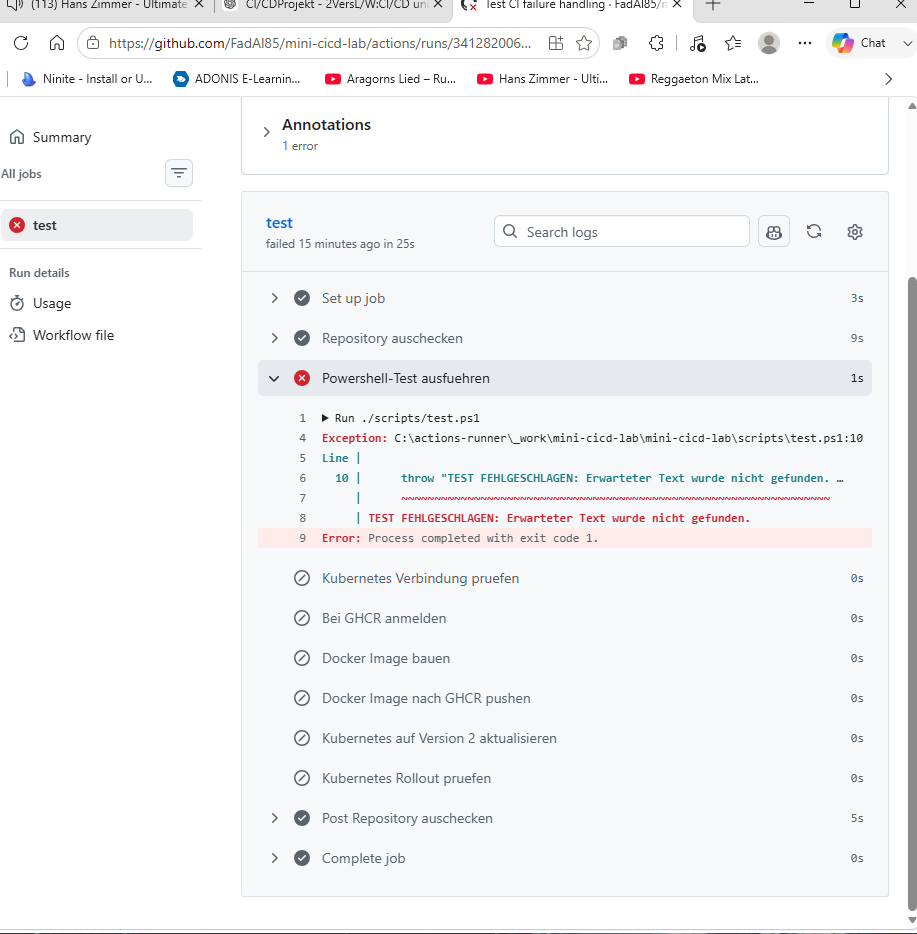

# Pipeline Failure Test

## Objective

The goal of this test was to verify that the CI/CD pipeline stops correctly when an automated validation step fails.

A safe CI/CD pipeline should not continue with image creation or deployment if the test stage reports an error.

---

## Test Setup

The existing PowerShell test checks whether the web application contains an expected text string.

The original condition was:

```powershell
if ($content -notmatch "Mini CI/CD Lab") {
```

For the failure test, the expected string was intentionally changed to a value that does not exist in the application:

```powershell
if ($content -notmatch "THIS_TEXT_DOES_NOT_EXIST") {
```

This change was deliberately introduced to force the automated test to fail.

---

## Why the Test Fails

The PowerShell script reads the content of `index.html` and checks whether the expected text exists.

Because `THIS_TEXT_DOES_NOT_EXIST` is not contained in the application, the condition becomes true and the script executes:

```powershell
throw "TEST FEHLGESCHLAGEN: Erwarteter Text wurde nicht gefunden."
```

The `throw` statement terminates the test with an error.

The process therefore returns a non-zero exit code.

---

## Expected Behavior

The expected pipeline behavior was:

```text
Code Change
    |
    v
Git Commit
    |
    v
Git Push
    |
    v
GitHub Actions
    |
    v
PowerShell Test
    |
    X
Test Failure
    |
    v
Pipeline Stops
```

The following workflow steps were expected to be skipped:

- Kubernetes connectivity check
- GHCR login
- Docker image build
- Docker image push
- Kubernetes deployment update
- Kubernetes rollout check

---

## Result

The self-hosted GitHub Actions runner successfully received and executed the workflow job.

The PowerShell validation step failed with the expected error:

```text
TEST FEHLGESCHLAGEN: Erwarteter Text wurde nicht gefunden.
```

GitHub Actions reported:

```text
Process completed with exit code 1.
```

The workflow was marked as failed.

All subsequent Docker, GHCR and Kubernetes deployment steps were skipped.

---

## Evidence

The GitHub Actions run confirmed that the PowerShell test failed and that all subsequent build and deployment stages were skipped.

The following stages were not executed:

- Kubernetes connection check
- GHCR authentication
- Docker image build
- Docker image push
- Kubernetes deployment update
- Kubernetes rollout verification

A screenshot of the failed GitHub Actions run can be stored in the portfolio repository as:

`screenshots/pipeline-failure-test.png`

and referenced with:



---

## Verified Behavior

The experiment confirmed the following pipeline behavior:

```text
Failed Validation
       |
       v
Pipeline Stops
       |
       +--> No Docker Image Build
       |
       +--> No GHCR Push
       |
       +--> No Kubernetes Deployment
```

The currently running Kubernetes application therefore remained unchanged.

---

## Learning Outcome

This test demonstrated an important CI/CD principle:

**A deployment should only continue when the required validation stages complete successfully.**

The exercise provided practical experience with:

- intentionally creating a controlled CI failure
- reading GitHub Actions logs
- interpreting PowerShell exceptions
- understanding non-zero exit codes
- verifying skipped workflow stages
- confirming that a failed test prevents deployment
- observing the behavior of a self-hosted GitHub Actions runner

---

## Next Step

The intentionally introduced test failure will be corrected.

The pipeline will then be executed again to verify that:

1. the automated PowerShell test succeeds,
2. the Docker image is built,
3. the image is pushed to GHCR,
4. Kubernetes is updated,
5. the rollout completes successfully.

After restoring the pipeline, the next planned exercise is a controlled Kubernetes rollback test.